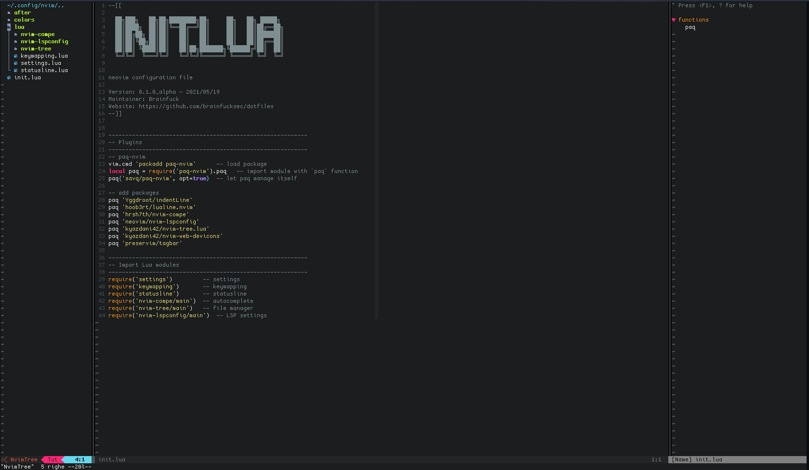
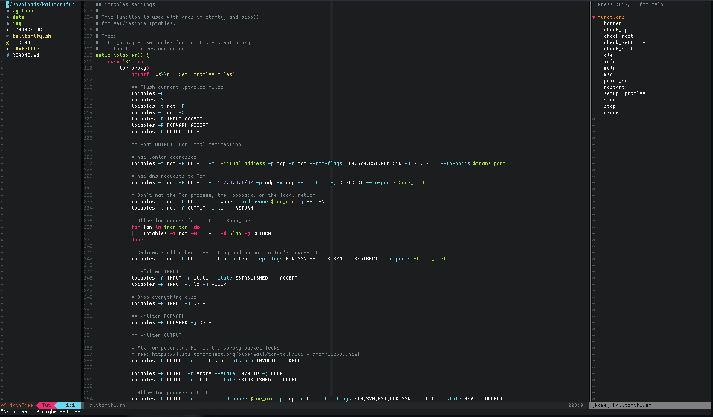
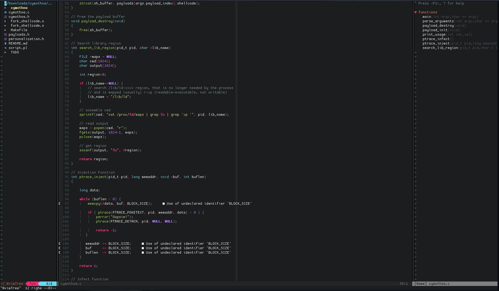
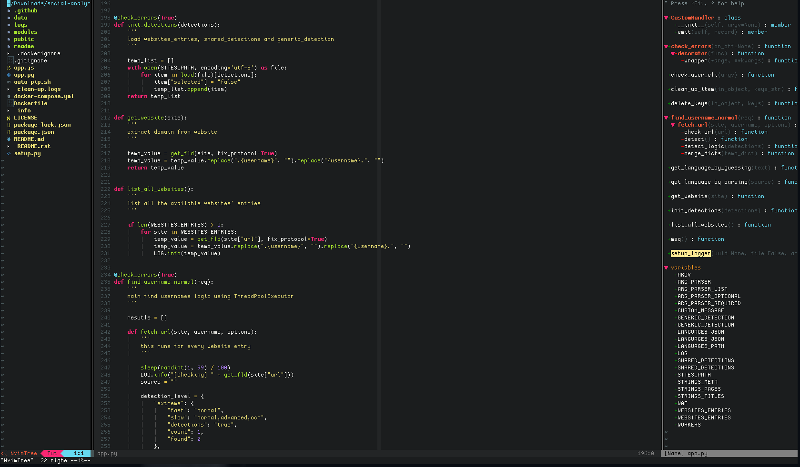

# Neovim Lua (from init.vim to init.lua)

My Neovim "IDE" configuration with Lua



This setup assumes is for the latest [nightly build](https://github.com/neovim/neovim/releases/tag/nightly) of Neovim. Since version 0.5 of Neovim is a development version, keep in mind that some APIs that are being actively worked on are not quite stable and might change before release.

## Plugins

[paq-nvim](https://github.com/savq/paq-nvim) - Neovim package manager written in Lua

[indentLine](https://github.com/Yggdroot/indentLine) - Show indent lines

[lualine.nvim](https://github.com/hoob3rt/lualine.nvim) - Statusline written in pure Lua

[nvim-compe](https://github.com/hrsh7th/nvim-compe) - Auto completion plugin

[nvim-lspconfig](https://github.com/neovim/nvim-lspconfig) - A collection of common configurations for Neovim's built-in language server client.

[nvim-tree.lua](https://github.com/kyazdani42/nvim-tree.lua) - A File Explorer written In Lua

[nvim-web-devicons](https://github.com/kyazdani42/nvim-web-devicons) - A Lua fork of vim-devicons

[tagbar](https://github.com/preservim/tagbar) - Browse the tags of the current file and get an overview of its structure


I use [Paq](https://github.com/savq/paq-nvim) for plugin manager, see: https://github.com/savq/paq-nvim#installation

## Neovim directory tree
```
~/.config/nvim
.
├── init.lua
└── lua
    ├── keymapping.lua
    ├── nvim-compe
    │   └── main.lua
    ├── nvim-lspconfig
    │   └── main.lua
    ├── nvim-tree
    │   └── main.lua
    ├── settings.lua
    └── statusline.lua
```

## Files and settings

* [init.lua](nvim/init.lua): Main configuration file (call `lua` modules, load plugins etc.)

* [lua](nvim/lua): Folder of `lua` modules, here reside all the Lua modules that needed. The logic is simple, insert a folder for plugin and/or settings written in Lua, and call it from `init.lua` file.  For plugins settings I use the convention `<plugin-folder/main.lua>` (See below).

* [keymapping.lua](nvim/lua/keymapping.lua): Keymaps configuration file, vim/neovim and plugins keymaps.

* [settings.lua](nvim/lua/settings.lua): General Neovim settings and configuration

* [statusline.lua](nvim/lua/statusline.lua): Statusline configuration file (in this case I use this file for [lualine.nvim](https://github.com/hoob3rt/lualine.nvim) configuration)

* [nvim-compe](nvim/lua/nvim-compe/main.lua): Autocompletion settings, TAB completion also for LSP

* [nvim-lspconfig](nvim/lua/nvim-lspconfig/main.lua): LSP configuration: in this file I insert the language servers for LSP

* [nvim-tree](nvim/lua/nvim-tree/main.lua): File manager settings

## LSP config

See: [nvim-lspconfig #CONFIG.md](https://github.com/neovim/nvim-lspconfig/blob/master/CONFIG.md)

* Bash - [bashls](https://github.com/bash-lsp/bash-language-server)

* Python - [pyright](https://github.com/neovim/nvim-lspconfig/blob/master/CONFIG.md#bashls)

* C, C++ - [clangd](https://github.com/neovim/nvim-lspconfig/blob/master/CONFIG.md#clangd)

* HTML, CSS, JavaScript - [vscode-html](https://github.com/neovim/nvim-lspconfig/blob/master/CONFIG.md#ht)

## Screenshots

`Bash`



`C`



`Python`



Colorscheme: [molokai](https://github.com/tomasr/molokai)

Fonts: [Cozette](https://github.com/slavfox/Cozette)

Icons: [nvim-web-devicons](https://github.com/kyazdani42/nvim-web-devicons)

## TODO

* Improve section [LSP config](#lsp-config)

* Test [nvim-treesitter](https://github.com/nvim-treesitter/nvim-treesitter)
---

## Resources

* https://github.com/nanotee/nvim-lua-guide

* https://alpha2phi.medium.com/neovim-init-lua-e80f4f136030

* https://oroques.dev/notes/neovim-init/

* https://icyphox.sh/blog/nvim-lua/

## Examples:

* https://github.com/mjlbach/defaults.nvim/blob/master/init.lua

* https://github.com/siduck76/neovim-dots

## Lua resources

* Lua in Y minutes - https://learnxinyminutes.com/docs/lua/

* Lua Quick Guide - https://github.com/medwatt/Notes/blob/main/Lua/Lua_Quick_Guide.ipynb

* Lua 5.1 Reference Manual - https://www.lua.org/manual/5.1/

## Disclaimer

This configuration is in alpha version, See: `Version` on [init.lua](nvim/init.lua) as a reference.
I work fine with this configuration but it is still not intended for daily use, see my current [init.vim](https://github.com/brainfucksec/dotfiles/blob/master/.config/nvim/init.vim) configuration on my
[dotfiles](https://github.com/brainfucksec/dotfiles) for the "stable" setup that I use on some operating systems.

As all my setups I try to follow the [KISS](https://en.wikipedia.org/wiki/KISS_principle) principle, probably some concepts may not be valid for everyone, then feel free to take what you need but don't install anything without checking first!
