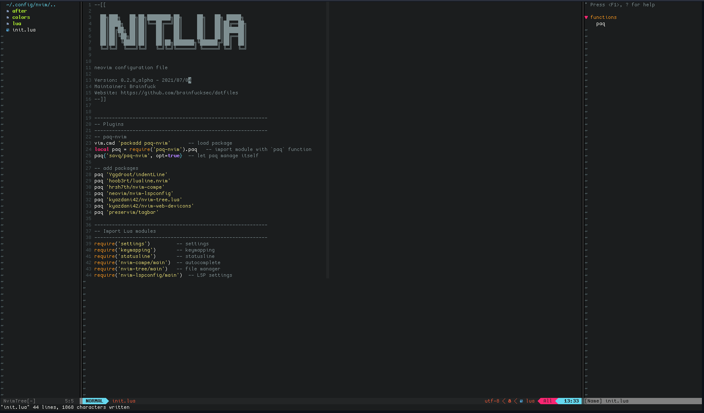
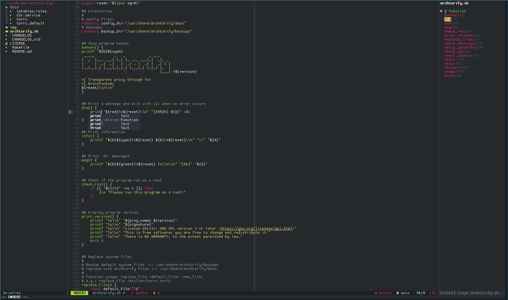
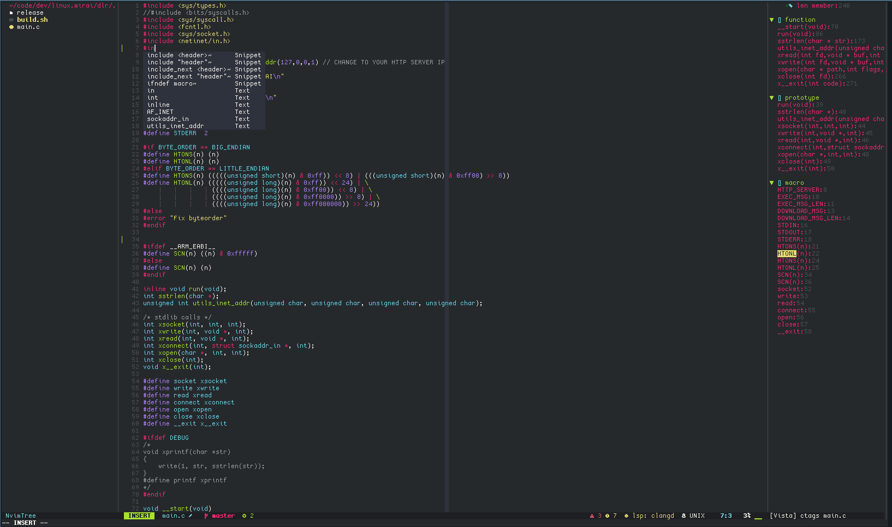
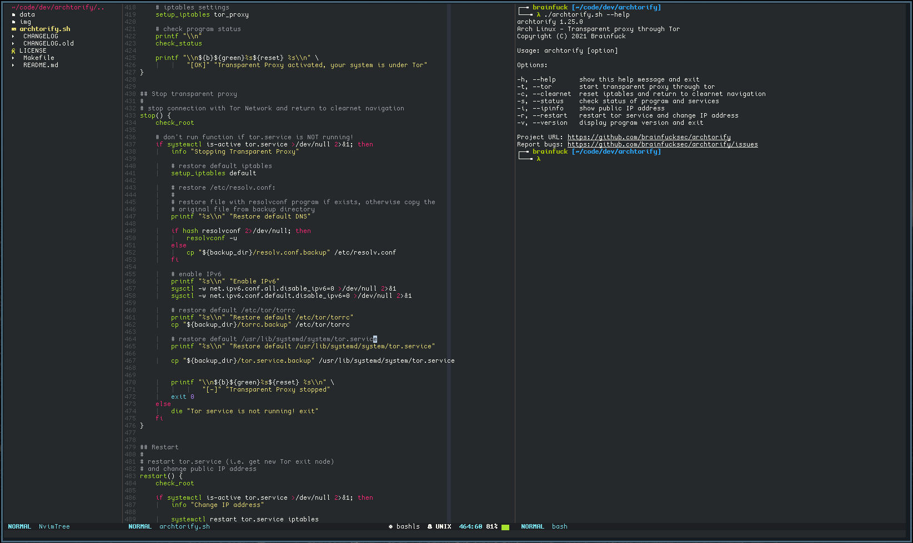

# Neovim Lua

### My Neovim configuration with Lua



This setup require [neovim >= v0.5.1](https://github.com/neovim/neovim/releases/tag/v0.5.1)

## Plugins

[packer.nvim](https://github.com/wbthomason/packer.nvim) -  A use-package inspired plugin manager for Neovim

[nvim-tree.lua](https://github.com/kyazdani42/nvim-tree.lua) - A File Explorer written In Lua

[feline.nvim](https://github.com/Famiu/feline.nvim) - A minimal, stylish and customizable statusline for Neovim written in Lua

[indentLine](https://github.com/Yggdroot/indentLine) - Show indent lines

[nvim-autopairs](https://github.com/windwp/nvim-autopairs) - A super powerful autopairs for Neovim

[vista.vim](https://github.com/liuchengxu/vista.vim) - View and search LSP symbols, tags in Vim/NeoVim

[nvim-treesitter](https://github.com/nvim-treesitter/nvim-treesitter) - Nvim Treesitter configurations and abstraction layer

[nvim-cmp](https://github.com/hrsh7th/nvim-cmp) - Auto completion plugin

[nvim-lspconfig](https://github.com/neovim/nvim-lspconfig) - A collection of common configurations for Neovim's built-in language server client

[LuaSnip](https://github.com/L3MON4D3/LuaSnip) - Snippet Engine for Neovim written in Lua

[nvim-web-devicons](https://github.com/kyazdani42/nvim-web-devicons) - A Lua fork of vim-devicons

[gitsigns](https://github.com/lewis6991/gitsigns.nvim) - Super fast git decorations implemented purely in lua/teal

## Directory tree of Lua files
```
~/.config/nvim
├── after
├── init.lua
└── lua
    ├── keymaps.lua
    ├── plugins
    │   ├── feline.lua
    │   ├── nvim-autopairs.lua
    │   ├── nvim-cmp.lua
    │   ├── nvim-lspconfig.lua
    │   ├── nvim-tree.lua
    │   ├── nvim-treesitter.lua
    │   ├── packer.lua
    │   └── vista.lua
    └── settings.lua
```

## Files and settings

* [init.lua](nvim/init.lua): Main configuration file (call `lua` modules, load plugins etc.)

* [lua](nvim/lua): Folder of `lua` modules, here reside all the Lua modules that needed. These modules are called from `init.lua` file (See below).  For plugins settings I use the convention `/lua/plugins/<plugin_name>.lua>`.  See: https://github.com/nanotee/nvim-lua-guide#where-to-put-lua-files

* [settings.lua](nvim/lua/settings.lua): General Neovim settings and configuration

* [keymaps.lua](nvim/lua/keymaps.lua): Keymaps configuration file, vim/neovim and plugins keymaps.

* [plugins/packer.lua](nvim/lua/plugins/packer.lua): Plugin manager settings

* [plugins/nvim-tree.lua](nvim/lua/plugins/nvim-tree.lua): File manager settings

* [plugins/feline.lua](nvim/lua/plugins/feline.lua): Statusline configuration file

* [plugins/nvim-cmp.lua](nvim/lua/plugins/nvim-cmp.lua): Autocompletion settings

* [plugins/nvim-autopairs](nvim/lua/plugins/nvim-autopairs.lua): Autoclose brackets

* [plugins/nvim-lspconfig.lua](nvim/lua/plugins/nvim-lspconfig.lua): LSP configuration (language servers, keybinding)

* [plugins/vista.lua](nvim/lua/plugins/vista.lua): Tag viewer settings

* [plugins/nvim-treesitter](nvim/lua/plugins/nvim-treesitter): Treesitter interface configuration

## Screenshots







## Appearance

Colorscheme: [Neovim Monokai](https://github.com/tanvirtin/monokai.nvim)

Fonts: [Cozette](https://github.com/slavfox/Cozette)

Icons: [nvim-web-devicons](https://github.com/kyazdani42/nvim-web-devicons)

## Installation

1. Install [neovim >= v0.5.1](https://github.com/neovim/neovim/releases/tag/v0.5.0)

2. Install [npm](https://github.com/npm/cli) (for download the packages of LSP language servers)

3. Download [this repository](https://github.com/brainfucksec/neovim-lua) with `git` and copy the `nvim` folder
```bash
    git clone https://github.com/brainfucksec/neovim-lua.git
    cd neovim-lua/
    cp -Rv nvim ~/.config/nvim/
```

4. Install [packer.nvim](https://github.com/wbthomason/packer.nvim) for manage the plugins, see: https://github.com/wbthomason/packer.nvim#quickstart

## LSP Configuration

1. Install LSP language servers with `npm`
```bash
    sudo npm install -g bash-language-server pyright vscode-langservers-extracted tsserver
```

2. Install [clang](https://clangd.llvm.org/installation.html) for use LSP with [clangd](https://github.com/neovim/nvim-lspconfig/blob/master/CONFIG.md#clangd)

3. Open a source file of one of the supported languages with `neovim`, in the Neovim cmd line run command [:LspInfo](https://github.com/neovim/nvim-lspconfig#built-in-commands) for testing the LSP support

### Languages currently supported:

Bash - [bashls](https://github.com/neovim/nvim-lspconfig/blob/master/CONFIG.md#bashls)

Python - [pyright](https://github.com/neovim/nvim-lspconfig/blob/master/CONFIG.md#pyright)

C-C++ - [clangd](https://github.com/neovim/nvim-lspconfig/blob/master/CONFIG.md#clangd)

HTML/CSS/JSON - [vscode-html](https://github.com/neovim/nvim-lspconfig/blob/master/CONFIG.md#html)

JavaScript/TypeScript - [tsserver](https://github.com/typescript-language-server/typescript-language-server) (under development)


See: [nvim-lspconfig #CONFIG.md](https://github.com/neovim/nvim-lspconfig/blob/master/CONFIG.md)

## TODO

* Add Lua to LSP configuration
* Add alternative color scheme

---

## Guides and resources

* https://github.com/nanotee/nvim-lua-guide

* https://alpha2phi.medium.com/neovim-init-lua-e80f4f136030

* https://oroques.dev/notes/neovim-init/

* https://www.reddit.com/r/neovim/

* https://github.com/siduck76/NvChad

* https://github.com/ibhagwan/nvim-lua

## Lua resources

* Lua in Y minutes - https://learnxinyminutes.com/docs/lua/

* Lua Quick Guide - https://github.com/medwatt/Notes/blob/main/Lua/Lua_Quick_Guide.ipynb

* Lua 5.4 Reference Manual - https://www.lua.org/manual/5.4/

## Disclaimer

* This configuration is in development version.  See: `Version` on [init.lua](nvim/init.lua) file.

* As all my setups I try to follow the [KISS](https://en.wikipedia.org/wiki/KISS_principle) principle, probably some concepts may not be valid for everyone, then feel free to take what you need but don't install anything without checking first!
---

#### Thanks to all the authors of the sources mentioned above and to all the others from whom I "stole" some configs :)
