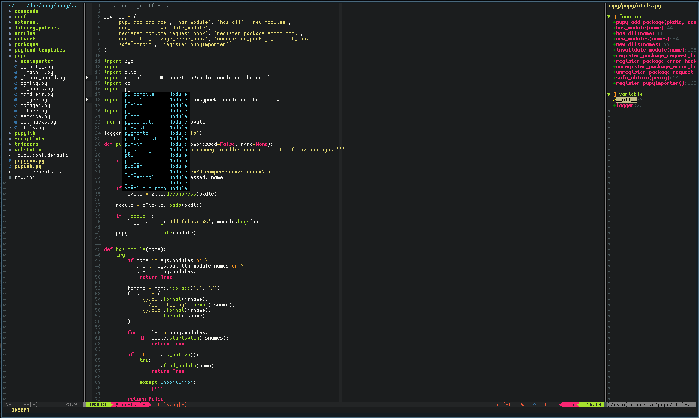
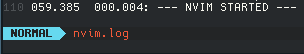

# Neovim Lua

### My Neovim configuration with Lua


This setup is for [neovim >= v0.5.0](https://github.com/neovim/neovim/releases/tag/v0.5.0)

## Plugins

[paq-nvim](https://github.com/savq/paq-nvim) - Neovim package manager written in Lua

[indentLine](https://github.com/Yggdroot/indentLine) - Show indent lines

[lualine.nvim](https://github.com/hoob3rt/lualine.nvim) - Statusline written in pure Lua

[nvim-cmp](https://github.com/hrsh7th/nvim-cmp) - Auto completion plugin

[nvim-lspconfig](https://github.com/neovim/nvim-lspconfig) - A collection of common configurations for Neovim's built-in language server client.

[nvim-tree.lua](https://github.com/kyazdani42/nvim-tree.lua) - A File Explorer written In Lua

[nvim-web-devicons](https://github.com/kyazdani42/nvim-web-devicons) - A Lua fork of vim-devicons

[tagbar](https://github.com/preservim/tagbar) - Browse the tags of the current file and get an overview of its structure


I use [Paq](https://github.com/savq/paq-nvim) for plugin manager, see: https://github.com/savq/paq-nvim#installation

## Directory tree of Lua files
```
~/.config/nvim
.
├── init.lua
└── lua
    ├── keymapping.lua
    ├── nvim-cmp
    │   └── main.lua
    ├── nvim-lspconfig
    │   └── main.lua
    ├── nvim-tree
    │   └── main.lua
    ├── settings.lua
    └── statusline.lua
```

## Files and settings

* [init.lua](nvim/init.lua): Main configuration file (call `lua` modules, load plugins etc.)

* [lua](nvim/lua): Folder of `lua` modules, here reside all the Lua modules that needed. The logic is simple, inside the `lua` folder there are the files and/or folders for neovim and plugins settings (written in Lua), these modules are called from `init.lua` file (See below).  For plugins settings I use the convention `<plugin-folder/main.lua>`.  See: https://github.com/nanotee/nvim-lua-guide#where-to-put-lua-files

* [keymapping.lua](nvim/lua/keymapping.lua): Keymaps configuration file, vim/neovim and plugins keymaps.

* [settings.lua](nvim/lua/settings.lua): General Neovim settings and configuration

* [statusline.lua](nvim/lua/statusline.lua): Statusline configuration file (in this case I use this file for [lualine.nvim](https://github.com/hoob3rt/lualine.nvim) configuration)

* [nvim-cmp](nvim/lua/nvim-cmp/main.lua): Autocompletion settings, TAB completion also for LSP

* [nvim-lspconfig](nvim/lua/nvim-lspconfig/main.lua): LSP configuration: in this file I insert the language servers for LSP

* [nvim-tree](nvim/lua/nvim-tree/main.lua): File manager settings

## Screenshots

`Bash`


`C`


`Python`



## Appearance

Colorscheme: [molokai](https://github.com/tomasr/molokai)

Fonts: [Cozette](https://github.com/slavfox/Cozette)

Icons: [nvim-web-devicons](https://github.com/kyazdani42/nvim-web-devicons)

## Startup time



## Installation

1. Install [neovim v0.5.0](https://github.com/neovim/neovim/releases/tag/v0.5.0)

2. Install [npm](https://github.com/npm/cli) (for download the packages of LSP language servers)

3. Download [this repository](https://github.com/brainfucksec/neovim-lua) with `git` and copy the required folders
```bash
    git clone https://github.com/brainfucksec/neovim-lua.git
    cd neovim-lua/
    cp -Rv nvim ~/.config/nvim/
```

4. Install [Paq](https://github.com/savq/paq-nvim#installation)

5. Open `neovim` and run the command [:PaqInstall](https://github.com/savq/paq-nvim#commands) to install the plugins

## LSP Configuration

1. Install LSP language servers with `npm`
```bash
    sudo npm install -g bash-language-server pyright vscode-langservers-extracted
```

2. Install [clang](https://clangd.llvm.org/installation.html) for use LSP with [clangd](https://github.com/neovim/nvim-lspconfig/blob/master/CONFIG.md#clangd)

3. Open a file with `neovim` and run command [:LspInfo](https://github.com/neovim/nvim-lspconfig#built-in-commands) for testing the LSP support

Supported languages in my configuration:

Bash - [bashls](https://github.com/neovim/nvim-lspconfig/blob/master/CONFIG.md#bashls)

Python - [pyright](https://github.com/neovim/nvim-lspconfig/blob/master/CONFIG.md#pyright)

C, C++ - [clangd](https://github.com/neovim/nvim-lspconfig/blob/master/CONFIG.md#clangd)

HTML, CSS, JavaScript - [vscode-html](https://github.com/neovim/nvim-lspconfig/blob/master/CONFIG.md#html)

See: [nvim-lspconfig #CONFIG.md](https://github.com/neovim/nvim-lspconfig/blob/master/CONFIG.md)

## TODO

* Add Lua (and other languages) to LSP configuration

* Test [Vista.vim](https://github.com/liuchengxu/vista.vim)

* Add a start page when Neovim is opened without arguments
---

## Resources

* https://github.com/nanotee/nvim-lua-guide

* https://alpha2phi.medium.com/neovim-init-lua-e80f4f136030

* https://oroques.dev/notes/neovim-init/

* https://icyphox.sh/blog/nvim-lua/

## Examples:

* https://github.com/mjlbach/defaults.nvim/blob/master/init.lua

* https://github.com/siduck76/NvChad

## Lua resources

* Lua in Y minutes - https://learnxinyminutes.com/docs/lua/

* Lua Quick Guide - https://github.com/medwatt/Notes/blob/main/Lua/Lua_Quick_Guide.ipynb

* Lua 5.1 Reference Manual - https://www.lua.org/manual/5.1/

## Disclaimer

As all my setups I try to follow the [KISS](https://en.wikipedia.org/wiki/KISS_principle) principle, probably some concepts may not be valid for everyone, then feel free to take what you need but don't install anything without checking first!
