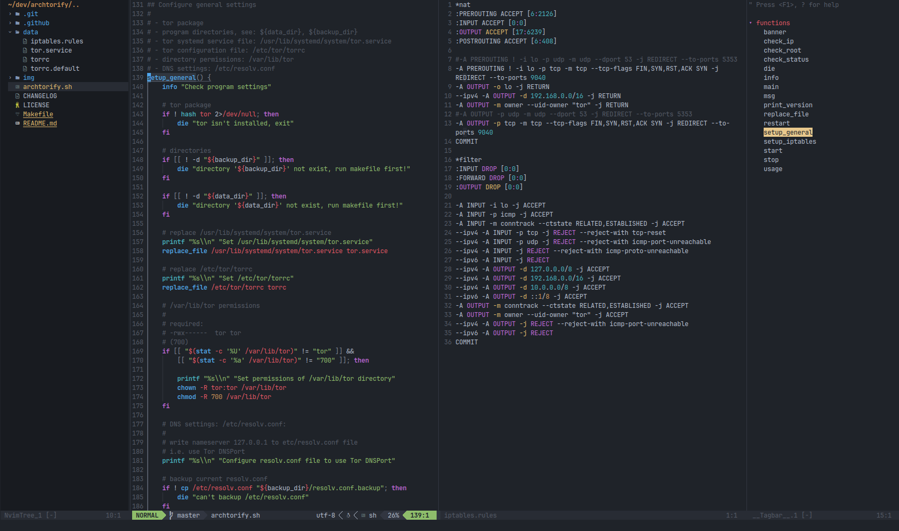
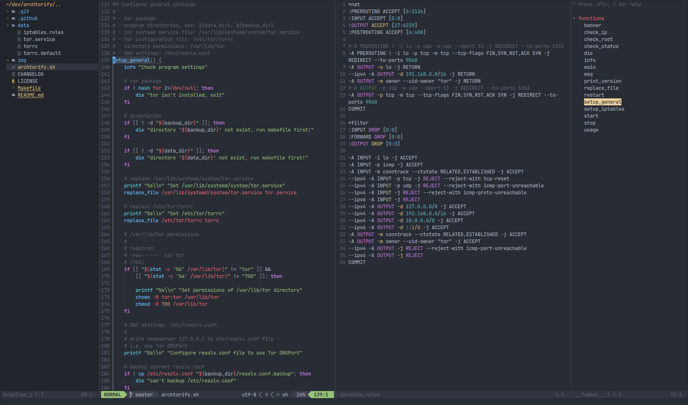
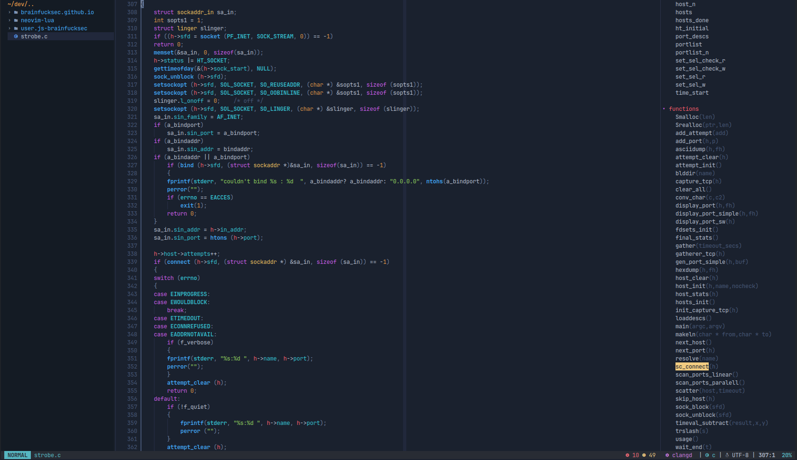
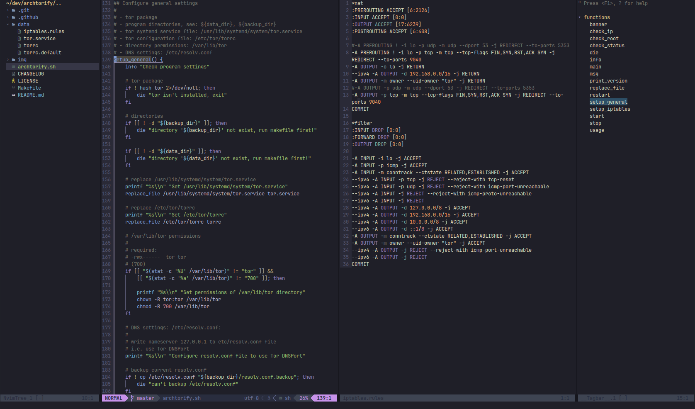
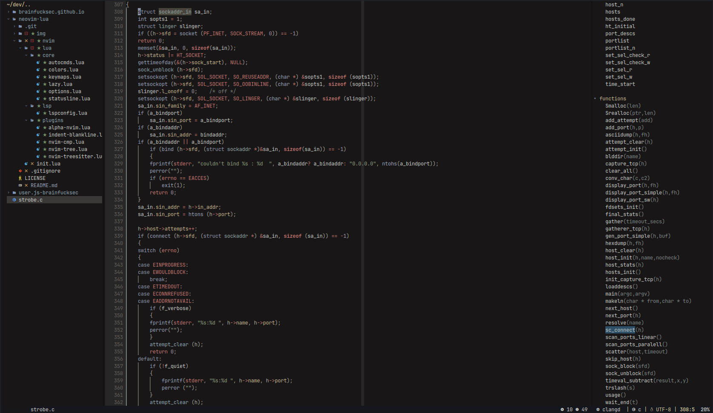
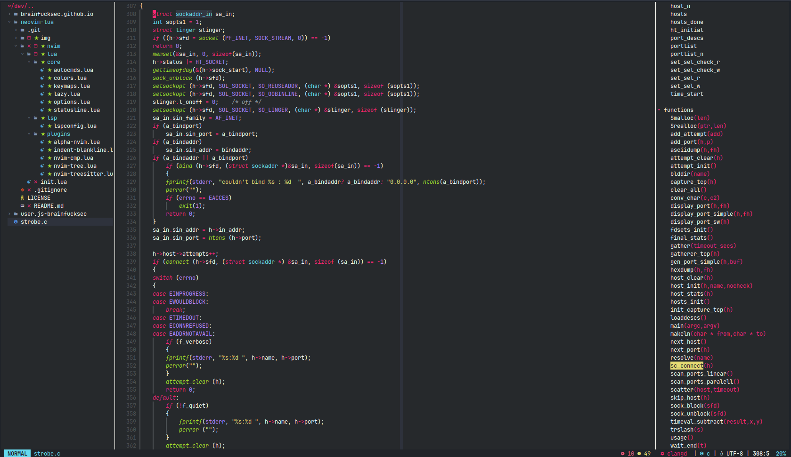
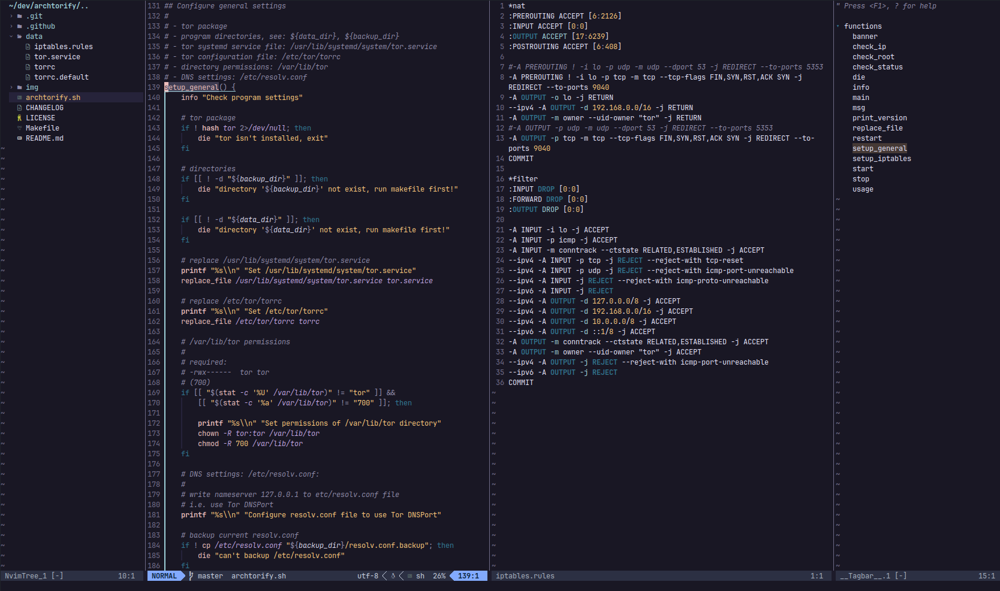
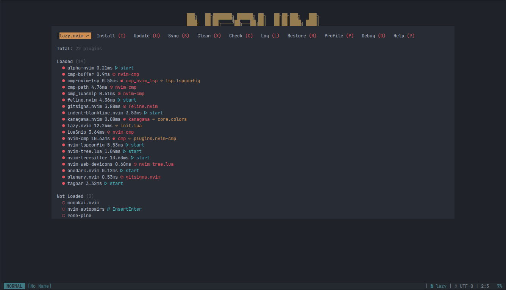

<p align="center">

</p>

<h3 align="center">
Neovim KISS configuration with Lua and LSP
</h3>

---

## Table of Contents

* [Plugins](#plugins)
* [Directory Tree](#directory-tree)
* [Files and Settings](#files-and-settings)
* [Installation](#installation)
* [LSP Configuration](#lsp-configuration)
* [Appearance](#appearance)
* [Keymaps](#keymaps)
* [Configuration Check](#configuration-check)
* [Screenshots](#screenshots)
* [Guides and Resources](#guides-and-resources)
* [Other Neovim Lua Project](#other-neovim-lua-projects)
* [Lua Resources](#lua-resources)

## Plugins

[lazy.nvim](https://github.com/folke/lazy.nvim) - A modern plugin manager for Neovim

[lualine.nvim](https://github.com/nvim-lualine/lualine.nvim) - A blazing fast and easy to configure neovim statusline plugin written in pure lua.

[nvim-lspconfig](https://github.com/neovim/nvim-lspconfig) - A collection of common configurations for Neovim's built-in language server client

[nvim-cmp](https://github.com/hrsh7th/nvim-cmp) - Auto completion plugin

[LuaSnip](https://github.com/L3MON4D3/LuaSnip) - Snippet Engine for Neovim written in Lua

[nvim-tree.lua](https://github.com/kyazdani42/nvim-tree.lua) - A File Explorer written In Lua

[indentBlankline](https://github.com/lukas-reineke/indent-blankline.nvim) - Adds indentation guides to all lines (including empty lines)

[nvim-autopairs](https://github.com/windwp/nvim-autopairs) - A super powerful autopairs for Neovim

[Tagbar](https://github.com/preservim/tagbar) - A class outline viewer for Vim

[gitsigns](https://github.com/lewis6991/gitsigns.nvim) - Super fast git decorations implemented purely in lua/teal

[nvim-treesitter](https://github.com/nvim-treesitter/nvim-treesitter) - Nvim Treesitter configurations and abstraction layer

[alpha-nvim](https://github.com/goolord/alpha-nvim) - A fast and highly customizable greeter for neovim.

[nvim-web-devicons](https://github.com/kyazdani42/nvim-web-devicons) - A Lua fork of vim-devicons

## Directory Tree

`${HOME}/.config/nvim`


## Files and Settings

`/nvim`

* [init.lua](nvim/init.lua): Main configuration file that call `lua` modules

* [lua](nvim/lua): The directory of `lua` modules, these modules are called in the `init.lua` file (see below).

See: [nanotee/nvim-lua-guide: Where to put Lua files](https://github.com/nanotee/nvim-lua-guide#where-to-put-lua-files)

`/nvim/lua/core`

* [autocmds.lua](nvim/lua/core/autocmds.lua): Define autocommands with Lua APIs

* [colors.lua](nvim/lua/core/colors.lua): Define Neovim and plugins color scheme

* [keymaps.lua](nvim/lua/core/keymaps.lua): Keymaps configuration file, Neovim and plugins keymaps

* [lazy.lua](nvim/lua/core/lazy.lua): Plugin manager configuration file

* [options.lua](nvim/lua/core/options.lua): General Neovim settings

* [statusline.lua](nvim/lua/core/statusline.lua): Statusline configuration file

`/nvim/lua/lsp`

* [lspconfig.lua](nvim/lua/lsp/lspconfig.lua): LSP configuration (language servers, keybinding)

`/nvim/lua/plugins`

* [alpha-nvim.lua](nvim/lua/plugins/alpha-nvim.lua): Dashboard

* [indent-blankline.lua](nvim/lua/plugins/indent-blankline.lua): Indent line

* [nvim-cmp.lua](nvim/lua/plugins/nvim-cmp.lua): Autocompletion settings

* [nvim-tree.lua](nvim/lua/plugins/nvim-tree.lua): File manager settings

* [nvim-treesitter](nvim/lua/plugins/nvim-treesitter): Treesitter interface configuration

## Installation

1. Install [Neovim v0.10.x](https://github.com/neovim/neovim/releases/latest).

2. Install [Nerd Fonts](https://www.nerdfonts.com/font-downloads), (the font of the screenshots are `JetBrainsMono Nerd Font`).

3. Install [Node.js - npm](https://docs.npmjs.com/downloading-and-installing-node-js-and-npm) for download packages of LSP language servers, see: [LSP Configuration](#lsp-configuration).

4. Make a backup of your current `nvim` folder if necessary:

```term
mv ~/.config/nvim ~/.config/nvim.backup
```

5. Download neovim-lua with `git` and copy the `nvim` folder in the `${HOME}/.config` directory:

```term
git clone https://github.com/brainfucksec/neovim-lua.git
cd neovim-lua/
cp -Rv nvim ~/.config/
```

6. Install [lazy.nvim](https://lazy.folke.io/) for install and manage the plugins, see: [lazy.nvim - Installation](https://lazy.folke.io/installation)

7. Run Neovim for download/sync plugins with `lazy`

```term
nvim
```

## LSP Configuration

1. Install LSP language servers with `npm`, see: [Languages Currently Supported](languages-currently-supported)

```term
sudo npm install -g \
    bash-language-server \
    pyright \
    vscode-langservers-extracted \
    typescript typescript-language-server
```

2. Install additional packages for plugins support:

**C, C++:**

* [clang](https://clangd.llvm.org/installation.html) for use LSP with [clangd](https://github.com/neovim/nvim-lspconfig/blob/master/doc/configs.md#clangd).

* [ctags](https://github.com/universal-ctags/ctags) to view tags with [Tagbar](https://github.com/preservim/tagbar).

**Python:**

* [pynvim](https://github.com/neovim/pynvim)

3. Open a source file of one of the supported languages with Neovim, and run command [:LspInfo](https://github.com/neovim/nvim-lspconfig?tab=readme-ov-file#commands) for verify the LSP support.

See: [nvim-lspconfig - Quickstart](https://github.com/neovim/nvim-lspconfig?tab=readme-ov-file#quickstart)

### Languages Currently Supported

Lua - [builtin](https://neovim.io/doc/user/lua.html)

Bash - [bashls](https://github.com/neovim/nvim-lspconfig/blob/master/doc/configs.md#bashls)

Python - [pyright](https://github.com/neovim/nvim-lspconfig/blob/master/doc/configs.md#pyright)

C, C++ - [clangd](https://github.com/neovim/nvim-lspconfig/blob/master/doc/configs.md#clangd)

HTML, CSS, JSON - [vscode-langservers-extracted](https://github.com/neovim/nvim-lspconfig/blob/master/doc/configs.md#html)

JavaScript, TypeScript - [ts_ls](https://github.com/neovim/nvim-lspconfig/blob/master/doc/configs.md#ts_ls)

See: [nvim-lspconfig #doc/LSP configs](https://github.com/neovim/nvim-lspconfig/blob/master/doc/configs.md)

## Appearance

### Available Colorschemes

* [OneDark](https://github.com/navarasu/onedark.nvim)

* [Kanagawa](https://github.com/rebelot/kanagawa.nvim)

* [Neovim Monokai](https://github.com/tanvirtin/monokai.nvim)

* [Rose Pine](https://github.com/rose-pine/neovim)

**Fonts:** See: [Installation](#installation)

**Icons:** [nvim-web-devicons](https://github.com/kyazdani42/nvim-web-devicons)

See: [Screenshots](#screenshots)

The color scheme (default: OneDark) is defined in the following file:

* Neovim UI - [nvim/lua/core/colors.lua](nvim/lua/core/colors.lua):

```lua
--[[
Set Neovim UI color scheme.
Insert preferred color scheme in the `color_scheme` variable.
Color scheme is loaded at "Load color scheme" after settings sections, setup
must be called before loading.
--]]
local status_ok, color_scheme = pcall(require, 'onedark')

-- Color scheme setup (settings) before load:
require('onedark').setup {
    -- Your preferences here.
}

-- Load color scheme:
require('onedark').load()
```

## Keymaps

These are the default keymaps, in the following shortcuts, the `<leader>` key is set up to `,` (comma) character, see: [keymaps.lua](nvim/lua/core/keymaps.lua).

| Shortcut             | Mode          | Description                                       |
|----------------------|---------------|---------------------------------------------------|
| `kk`                 | Insert        | Esc with `kk`                                     |
| `<leader>c`          | Normal        | Clear search highlights                           |
| `<F2>`               | Normal        | Toggle Paste mode                                 |
| `<leader>tk/th`      | Normal        | Change split orientation (vertical/horizontal)    |
| `<Ctrl> + {h,j,k,l}` | Normal        | Move around splits windows                        |
| `<leader>r`          | Normal        | Reload configuration file                         |
| `<leader>s`          | Normal        | Save file                                         |
| `<leader>q`          | Normal        | Save (close all windows) and exit from Neovim     |
| `<Ctrl> + t`         | Normal        | Open terminal (`:Term`)                           |
| `<Esc>`              | Terminal      | Exit terminal                                     |
| `<Ctrl> + n`         | Normal        | Open NvimTree                                     |
| `<leader>z`          | Normal        | Open Tagbar                                       |

## Configuration Check

- Open nvim and run command `checkhealth`, you should not see any error in the output (except for the one related to the Python 2 interpreter if don't have it):

```vim
:checkhealth
```


- You can also use the `startuptime` option to read the nvim startup logs:

```term
nvim --startuptime > /tmp/nvim-start.log

nvim /tmp/nvim-start.log
```

See: `:help startuptime`

Also you can check the plugins configuration and startup time with `lazy`:

```vim
:checkhealth lazy
```

```vim
:Lazy profile
```

See: [lazy.nvim - Usage](https://lazy.folke.io/usage)

## Screenshots

<p align="center">

</p>

<details><summary> <b>(Click to expand)</b></summary>

**OneDark Darker**



**OneDark Dark**



**OneDark Cool**


**OneDark Deep**



**Kanagawa Wave** (lualine theme: palenight)



**Kanagawa Dragon** (lualine theme: seoul256)



**Monokai** (lualine theme: molokai)



**Rosé Pine** (lualine theme: nightfly)



**lazy.nvim**



</details>

## Guides and Resources

* [Lua - Neovim docs](https://neovim.io/doc/user/lua.html)

* [Lua-guide - Neovim docs](https://neovim.io/doc/user/lua-guide.html#lua-guide)

* [Everything you need to know to configure neovim using lua](https://vonheikemen.github.io/devlog/tools/configuring-neovim-using-lua/)

* [reddit /r/neovim](https://www.old.reddit.com/r/neovim/)

* [Lemmy: programming.dev/c/neovim](https://programming.dev/c/neovim)


## Other Neovim Lua Projects

* [NvChad](https://github.com/siduck76/NvChad)

* [nvim-ide](https://github.com/ldelossa/nvim-ide)

* [nv-ide](https://github.com/crivotz/nv-ide)

* [Neovim from scratch](https://github.com/LunarVim/Neovim-from-scratch)

* [CosmicNvim](https://github.com/CosmicNvim/CosmicNvim)

## Lua Resources

* [Learn X in Y minutes: Where X=Lua](https://learnxinyminutes.com/docs/lua/)

* [Lua Quick Guide](https://github.com/medwatt/Notes/blob/main/Lua/Lua_Quick_Guide.ipynb)

* [Lua 5.4 Reference Manual](https://www.lua.org/manual/5.4/)

---

## Disclaimer

This setup is based on [KISS](https://en.wikipedia.org/wiki/KISS_principle) principle, probably some concepts may not be valid for everyone. Then feel free to take what you need but **don't install anything without checking first!**

This setup is not a Framework but it is the configuration I use to work on Linux, it can be used by default as it can be a start point to understand how Neovim is structured and maybe improve this config.  Is the base configuration I use, and it tries to stay as simple as possible, with each addition weighted along these lines.

[Less is more](https://en.wikipedia.org/wiki/Less_is_more)

## Thanks to:

- [All the contributors](https://github.com/brainfucksec/neovim-lua/graphs/contributors) who helped improve this setup with their reports and advices.

- All the authors of the sources mentioned above.

- The users of [/r/Neovim](https://old.reddit.com/r/neovim/) subreddit for the support of the configuration.

