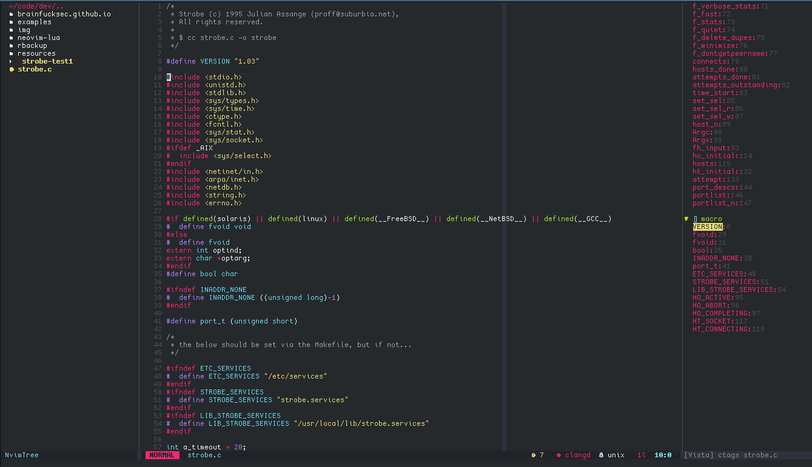
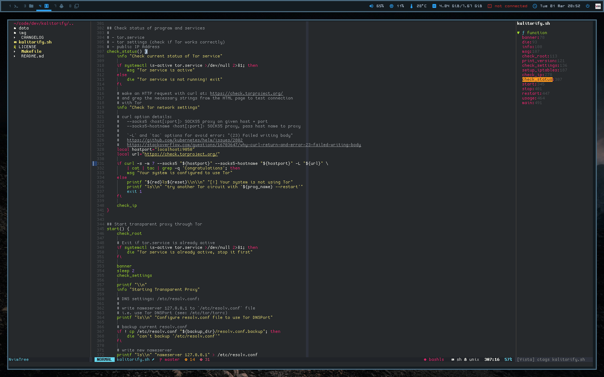
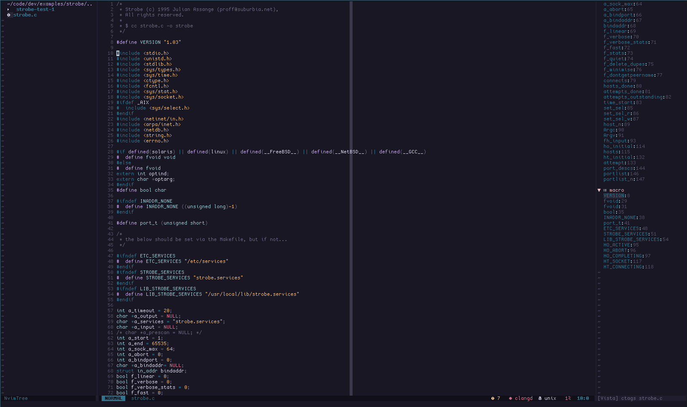
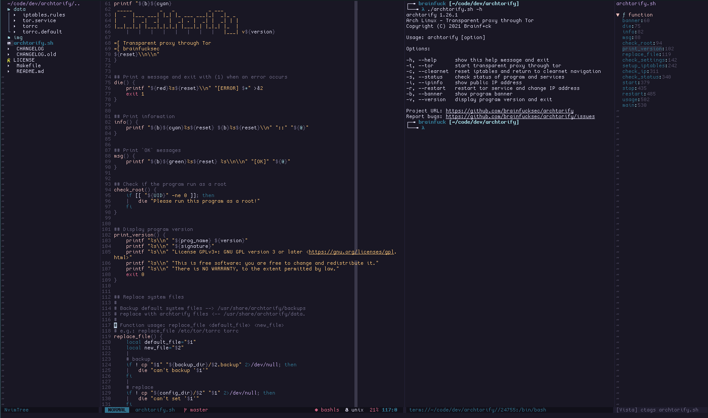
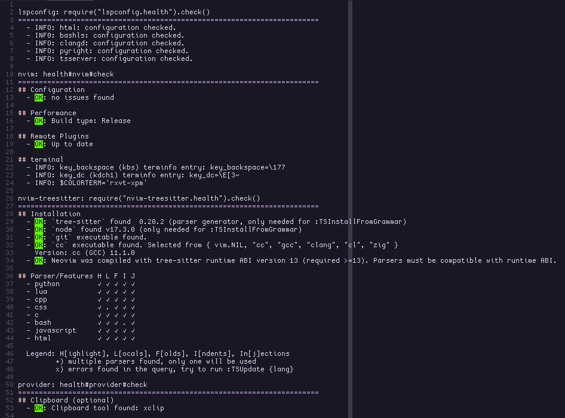

<p align="center">

</p>

<h3 align="center">
Neovim KISS configuration with Lua
</h3>

## Plugins

[packer.nvim](https://github.com/wbthomason/packer.nvim) -  A use-package inspired plugin manager for Neovim

[nvim-tree.lua](https://github.com/kyazdani42/nvim-tree.lua) - A File Explorer written In Lua

[indentBlankline](https://github.com/lukas-reineke/indent-blankline.nvim) - Adds indentation guides to all lines (including empty lines)

[nvim-autopairs](https://github.com/windwp/nvim-autopairs) - A super powerful autopairs for Neovim

[feline.nvim](https://github.com/Famiu/feline.nvim) - A minimal, stylish and customizable statusline for Neovim written in Lua

[nvim-web-devicons](https://github.com/kyazdani42/nvim-web-devicons) - A Lua fork of vim-devicons

[vista.vim](https://github.com/liuchengxu/vista.vim) - View and search LSP symbols, tags in Vim/NeoVim

[nvim-treesitter](https://github.com/nvim-treesitter/nvim-treesitter) - Nvim Treesitter configurations and abstraction layer

[nvim-cmp](https://github.com/hrsh7th/nvim-cmp) - Auto completion plugin

[nvim-lspconfig](https://github.com/neovim/nvim-lspconfig) - A collection of common configurations for Neovim's built-in language server client

[LuaSnip](https://github.com/L3MON4D3/LuaSnip) - Snippet Engine for Neovim written in Lua

[gitsigns](https://github.com/lewis6991/gitsigns.nvim) - Super fast git decorations implemented purely in lua/teal

[alpha-nvim](https://github.com/goolord/alpha-nvim) - A fast and highly customizable greeter for neovim.

## Directory Tree of Lua Files

`${HOME}/.config/nvim`

```
├── lua
│   ├── core
│   │   ├── colors.lua
│   │   ├── keymaps.lua
│   │   └── settings.lua
│   ├── plugins
│   │   ├── alpha-nvim.lua
│   │   ├── feline.lua
│   │   ├── indent-blankline.lua
│   │   ├── nvim-cmp.lua
│   │   ├── nvim-lspconfig.lua
│   │   ├── nvim-tree.lua
│   │   ├── nvim-treesitter.lua
│   │   └── vista.lua
│   └── packer_init.lua
├── plugin
│   └── packer_compiled.lua
└── init.lua
```

## Files and Settings

`/nvim`

* [init.lua](nvim/init.lua): Main configuration file that call `lua` modules

* [lua](nvim/lua): Folder of `lua` modules, here reside all the Lua modules that needed. These modules are called from `init.lua` file (see below).

See: https://github.com/nanotee/nvim-lua-guide#where-to-put-lua-files

`/nvim/lua`

* [packer_init.lua](nvim/lua/packer_init.lua): Load plugins

`/nvim/lua/core`

* [settings.lua](nvim/lua/core/settings.lua): General Neovim settings and configuration

* [keymaps.lua](nvim/lua/core/keymaps.lua): Keymaps configuration file, vim/neovim and plugins keymaps.

* [colors.lua](nvim/lua/core/colors.lua): Define colors (based on colorschemes)

`/nvim/lua/plugins`

* [packer.lua](nvim/lua/plugins/packer.lua): Plugin manager settings

* [alpha-nvim.lua](nvim/lua/plugins/alpha-nvim.lua): Dashboard

* [feline.lua](nvim/lua/plugins/feline.lua): Statusline configuration file

* [indent-blankline.lua](nvim/lua/plugins/indent-blankline.lua): Indent line

* [nvim-cmp.lua](nvim/lua/plugins/nvim-cmp.lua): Autocompletion settings

* [nvim-lspconfig.lua](nvim/lua/plugins/nvim-lspconfig.lua): LSP configuration (language servers, keybinding)

* [nvim-tree.lua](nvim/lua/plugins/nvim-tree.lua): File manager settings

* [nvim-treesitter](nvim/lua/plugins/nvim-treesitter): Treesitter interface configuration

* [vista.lua](nvim/lua/plugins/vista.lua): Tag viewer settings

## Appearance

**Colorschemes:**

* [Neovim Monokai](https://github.com/tanvirtin/monokai.nvim)

* [Rose Pine](https://github.com/rose-pine/neovim)

**Fonts:** [Cozette](https://github.com/slavfox/Cozette)

**Icons:** [nvim-web-devicons](https://github.com/kyazdani42/nvim-web-devicons)

## Screenshots

<p align="center">

</p>

**Monokai**





**Rosé Pine**





## Installation

1. Install [neovim v0.6.x](https://github.com/neovim/neovim/releases/latest)

2. Install [npm](https://github.com/npm/cli) (for download the packages of LSP language servers)

3. Download [this repository](https://github.com/brainfucksec/neovim-lua) with `git` and copy the `nvim` folder (make a backup of your current nvim folder if necessary):

```term
    git clone https://github.com/brainfucksec/neovim-lua.git
    cd neovim-lua/
    cp -Rv nvim ~/.config/
```

4. Install [packer.nvim](https://github.com/wbthomason/packer.nvim) for install and manage plugins, see: https://github.com/wbthomason/packer.nvim#quickstart

## LSP Configuration

1. Install LSP language servers with `npm`

```term
    sudo npm install -g bash-language-server pyright vscode-langservers-extracted typescript typescript-language-server
```

2. Install [clang](https://clangd.llvm.org/installation.html) for use LSP with [clangd](https://github.com/neovim/nvim-lspconfig/blob/master/doc/server_configurations.md#clangd)

3. Open a source file of one of the supported languages with `neovim`, in the Neovim cmd line run command [:LspInfo](https://github.com/neovim/nvim-lspconfig#built-in-commands) for testing the LSP support.

### Languages Currently Supported:

Bash - [bashls](https://github.com/neovim/nvim-lspconfig/blob/master/doc/server_configurations.md#bashls)

Python - [pyright](https://github.com/neovim/nvim-lspconfig/blob/master/doc/server_configurations.md#pyright)

C, C++ - [clangd](https://github.com/neovim/nvim-lspconfig/blob/master/doc/server_configurations.md#clangd)

HTML, CSS, JSON - [vscode-html](https://github.com/neovim/nvim-lspconfig/blob/master/doc/server_configurations.md#html)

JavaScript, TypeScript - [tsserver](https://github.com/neovim/nvim-lspconfig/blob/master/doc/server_configurations.md#tsserver)

See: [nvim-lspconfig #doc/server_configurations.md](https://github.com/neovim/nvim-lspconfig/blob/master/doc/server_configurations.md)

## Configuration check

- Open nvim and run command `checkhealth`, you should not see any error in the output (except for the one related to the Python 2 interpreter if don't have it):

```vim
:checkhealth
```



- You can also use the `startuptime` option to read the nvim startup logs:

```term
nvim --startuptime > /tmp/nvim-start.log

nvim /tmp/nvim-start.log
```

See: `:help startuptime`

## Guides and resources

* https://neovim.io/doc/user/lua.html

* https://github.com/nanotee/nvim-lua-guide

* https://dev.to/vonheikemen/everything-you-need-to-know-to-configure-neovim-using-lua-3h58

* https://www.reddit.com/r/neovim/

## Other Neovim Lua projects and examples

* https://github.com/siduck76/NvChad

* https://github.com/artart222/CodeArt

* https://github.com/crivotz/nv-ide

## Lua resources

* Lua in Y minutes - https://learnxinyminutes.com/docs/lua/

* Lua Quick Guide - https://github.com/medwatt/Notes/blob/main/Lua/Lua_Quick_Guide.ipynb

* Lua 5.4 Reference Manual - https://www.lua.org/manual/5.4/

## Disclaimer

As all my setups I try to follow the [KISS](https://en.wikipedia.org/wiki/KISS_principle) principle, probably some concepts may not be valid for everyone, then feel free to take what you need but **don't install anything without checking first!**

---

**Thanks to all the authors of the sources mentioned above and to all the others from whom I "stole" some configs :)**
